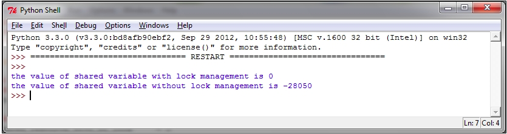

# Chapter 2. Thread-based Parallelism 基于线程的并发

In this chapter, we will cover the following recipes:  

在本章，我们会讨论以下话题：  

- How to use the Python threading module
- How to define a thread
- How to determine the current thread
- How to use a thread in a subclass
- Thread synchronization with Lock and RLock
- Thread synchronization with semaphores
- Thread synchronization with a condition
- Thread synchronization with an event
- How to use the with statement
- Thread communication using a queue
- Evaluating the performance of multithread applications
- The criticality of multithreaded programming

- 如何使用Python线程模块
- 如何定义一个线程
- 如何确定当前线程
- 如何在子类中使用线程
- 使用Lock的RLock的线程同步
- 使用信号系统的线程同步
- 使用条件的线程同步
- 使用事件的线程同步
- 如何和语句一起使用
- 使用队列进行线程通信
- 评估多线程应用的性能
- 多线程编程的重要性

## Introduction 引言

Currently, the most widely used programming paradigm for the management of concurrence in software applications is based on multithreading. Generally, an application is made by a single process that is divided into multiple independent threads, which represent activities of different types that run parallel and compete with each other.  

现在，软件应用中的并发管理绝大多数的编程样例都是基于多线程的。通常，
 
Although such a style of programming can lead to disadvantages of use and problems that need to be solved, modern applications with the mechanism of multithreading are still used quite widely.  

尽管这类风格的编程可能导致使用上的不利，以及需要去解决的问题，但是现在的使用多线程机制的应用依旧广泛使用。  

Practically, all the existing operating systems support multithreading, and in almost all programming languages, there are mechanisms that you can use to implement concurrent applications through the use of threads.  

几乎所有的现有操作系统和差不多全部的编程语言都支持多线程，都存在通过使用线程来实现并发应用的机制。  

Therefore, multithreaded programming is definitely a good choice to achieve concurrent applications. However, it is not the only choice available—there are several other alternatives, some of which, inter alia, perform better on the definition of thread.  

因此，多线程式编程是一个实现并发应用的非常好的选择。不过，

A thread is an independent execution flow that can be executed parallelly and concurrently with other threads in the system. Multiple threads can share data and resources, taking advantage of the so-called space of shared information. The specific implementation of threads and processes depends on the operating system on which you plan to run the application, but, in general, it can be stated that a thread is contained inside a process and that different threads in the same process conditions share some resources. In contrast to this, different processes do not share their own resources with other processes.  

Each thread appears to be mainly composed of three elements: program counter, registers, and stack. Shared resources with other threads of the same process essentially include data and operating system resources. Similar to what happens to the processes, even the threads have their own state of execution and can synchronize with each other. The states of execution of a thread are generally called ready, running, and blocked. A typical application of a thread is certainly parallelization of an application software, especially, to take advantage of modern multi-core processors, where each core can run a single thread. The advantage of threads over the use of processes lies in the performance, as the context switch between processes turns out to be much heavier than the switch context between threads that belong to the same process.  

每个线程都以三种主要的元素组成：程序计数器，注册器，以及栈。

Multithreaded programming prefers a communication method between threads using the space of shared information. This choice requires that the major problem that is to be addressed by programming with threads is related to the management of that space.  

多线程的程序的线程之间通讯优先使用的是

## Using the Python threading module 使用Python的线程模块

Python manages a thread via the threading package that is provided by the Python standard library. This module provides some very interesting features that make the threading-based approach a whole lot easier; in fact, the threading module provides several synchronization mechanisms that are very simple to implement.  

Python管理标准库提供的threading包来管理线程的。这个模块提供了很多的可以让基于线程的方法整个容易很多的有趣特性；实际上，threading模块提供多种异步继承

The major components of the threading module are:  

主要的线程模块组件如下：  

- The thread object
- The Lock object
- The RLock object
- The semaphore object
- The condition object
- The event object

- 线程对象
- Lock对象
- RLock对象
- 信号量对象
- 条件对象
- 事件对象

In the following recipes, we examine the features offered by the threading library with different application examples. For the examples that follow, we will refer to the Python distribution 3.3 (even though Python 2.7 could be used).  

在下面的方法中，我们验证了由线程库 

## How to define a thread  如何定义一个线程

The simplest way to use a thread is to instantiate it with a target function and then call the start() method to let it begin its work. The Python module threading has the Thread() method that is used to run processes and functions in a different thread:  

使用一个线程的最简单办法是让它实例化一个目标函数，然后通过

```python
class threading.Thread(group=None,
                       target=None,
                       name=None,
                       args=(),
                       kwargs={})
```

In the preceding code:  
前面的代码中的参数如下：  

- group: This is the value of group that should be None; this is reserved for future implementations
- target: This is the function that is to be executed when you start a thread activity
- name: This is the name of the thread; by default, a unique name of the form Thread-N is assigned to it
- args: This is the tuple of arguments that are to be passed to a target
- kwargs: This is the dictionary of keyword arguments that are to be used for the target function

- group：组赋值为None的组；该值作为未来实现而保留
- target：这个是当你启动线程时将被执行的函数
- name：该参数时线程的名称；默认，形式为Thread-N的唯一名称被使用。
- args：该参数是一个需要传递到目标函数的元祖参数
- kwargs：这是一个用于目标函数的关键字参数字典

It is useful to spawn a thread and pass arguments to it that tell it what work to do. This example passes a number, which is the thread number, and then prints out the result.  

在生成线程，并将参数传递到线程，告诉线程需要执行的内容时这些参数非常有用。这个例子传递了一个数字，这是一个线程编号，之后打印出结果。  

### How to do it…

Let's see how to define a thread with the threading module, for this, a few lines of code are necessary:  

我们来看看如何使用threading模块来定义一个线程，所以，我们有必要编写几行代码：  

```python
import threading

def function(i):
    print ("function called by thread %i\n"  %i)
    return

threads = []
for i in range(5):
    t = threading.Thread(target=function , args=(i,))
    threads.append(t)
    t.start()
    t.join()
```

The output of the preceding code should be, as follows:  

前面的代码输出如下：  


We should also point out that the output could be achieved in a different manner; in fact, multiple threads might print the result back to stdout at the same time, so the output order cannot be predetermined.  

我们还应该指出的是上面的结果可以使用不同的方法来实现；实际上，多线程可以在相同的时间将结果打印在标准输出上，所以输出顺序也是无法预先定义好的。  

### How it works…

To import the threading module, we simply use the Python command:  

要导入线程模块，我们可以简单的使用Python命令：  

```python
import threading
```

In the main program, we instantiate a thread, using the Thread object with a target function called function. Also, we pass an argument to the function that will be included in the output message:  

在主程序中，我们实例化一个线程，对Thread对象使用了一个包含目标函数所调用的函数。我们还对这个函数传递了会包含在输出消息中的参数：  

```python
t = threading.Thread(target=function , args=(i,))
```

The thread does not start running until the start() method is called, and that join() makes the calling thread wait until the thread has finished the execution:  

线程在不调用start()方法时是不会运行的，join()会让正在调用的线程等待直到线程完成执行：  

```python
t.start()
t.join() 
```

## How to determine the current thread 如何确定当前线程

Using arguments to identify or name the thread is cumbersome and unnecessary. Each Thread instance has a name with a default value that can be changed as the thread is created. Naming threads is useful in server processes with multiple service threads that handle different operations.  

使用参数或者名称来标识线程麻烦而且没有必要。每个线程实例都拥有一个在线程创建时就产生的可以被改变的默认值。命名线程在服务端需要使用不同的服务线程来处理不同的操作时非常有用。  

### How to do it…

To determine which thread is running, we create three target functions and import the time module to introduce a suspend execution of two seconds:  

要确定哪个线程在运行，我们创建目标函数，然后导入time模块以引入两秒钟的执行挂起：  

```python
import threading
import time

def first_function():
    print (threading.currentThread().getName()+\
           str(' is Starting \n'))
    time.sleep(2)
    print (threading.currentThread().getName()+\
           str( ' is Exiting \n'))
    return

def second_function():
    print (threading.currentThread().getName()+\
           str(' is Starting \n'))
    time.sleep(2)
    print (threading.currentThread().getName()+\
           str( ' is Exiting \n'))
    return

def third_function():
    print (threading.currentThread().getName()+\
           str(' is Starting \n'))
    time.sleep(2)
    print (threading.currentThread().getName()+\
           str( ' is Exiting \n'))
    return


if __name__ == "__main__":

    t1 = threading.Thread\
         (name='first_function', target=first_function)
    t2 = threading.Thread\
         (name='second_function', target=second_function)
    t3 = threading.Thread\
         (name='third_function',target=third_function)
    
    t1.start()
    t2.start()
    t3.start()
```

The output of this should be, as follows:  

输入内容如下：  


### How it works…

We instantiate a thread with a target function. Also, we pass the name that is to be printed and if it is not defined, the default name will be used:  

我们使用目标函数来实例化一个线程。我们还传递了希望打印的名称，如果线程名称没有定义的话，则使用默认名称：  

```python
t1 = threading.Thread(name='first_function', target=first_function)
t2 = threading.Thread(name='second_function', target=second_function)
t3 = threading.Thread(target=third_function)
```

Then, we call the start() and join() methods on them:  

然后，我们开始调用线程的start()和join()方法：  

```python
t1.start()
t2.start()
t3.start()
t1.join()
t2.join()
t3.join()
```

## How to use a thread in a subclass 如何在一个子类中使用线程

To implement a new thread using the threading module, you have to do the following:  

要使用threading模块实现一个新线程，你必须完成以下事项：  

- Define a new subclass of the Thread class
- Override the `__init__(self [,args])` method to add additional arguments
- Then, you need to override the `run(self [,args])` method to implement what the thread should do when it is started

- 定义一个新的Thread类的子类
- 重写`__init__(self [,args])`方法以添加额外的参数
- 然后，你需要重写`run(self [,args])`方法让线程开始后所需要执行的事情

Once you have created the new Thread subclass, you can create an instance of it and then start a new thread by invoking the start() method, which will, in turn, call the run() method.  

一旦你创建了新的Thread子类，那么你就可以创建它的实例，然后通过调用start()方法来启动一个新的线程，依照执行顺序，在调用方法。  

### How to do it…

To implement a thread in a subclass, we define the myThread class. It has two methods that must be overridden with the thread's arguments:  

要在一个子类中实现线程，我们要定义一个myThread类。它拥有两个必须包含了线程参数而且必须被重写的方法；  

```python
import threading
import time

exitFlag = 0

class myThread (threading.Thread):
    def __init__(self, threadID, name, counter):
        threading.Thread.__init__(self)
        self.threadID = threadID
        self.name = name
        self.counter = counter
    def run(self):
        print ("Starting " + self.name)
        print_time(self.name, self.counter, 5)
        print ("Exiting " + self.name)

def print_time(threadName, delay, counter):
    while counter:
        if exitFlag:
            thread.exit()
        time.sleep(delay)
        print ("%s: %s" %\
               (threadName, time.ctime(time.time())))
        counter -= 1

# Create new threads 创建新线程
thread1 = myThread(1, "Thread-1", 1)
thread2 = myThread(2, "Thread-2", 2)

# Start new Threads 启动新线程
thread1.start()
thread2.start()
print ("Exiting Main Thread")
```

When the previous code is executed, it produces the following result:  

当前面的代码被执行时，其输出结果如下：  


### How it works…

The threading module is the preferred form for creating and managing threads. Each thread is represented by a class that extends the Thread class and overrides its run() method. Then, this method becomes the starting point of the thread. In the main program, we create several objects of the myThread type; the execution of the thread begins when the start() method is called. Calling the constructor of the Thread class is mandatory—using it, we can redefine some properties of the thread as the name or group of the thread. The thread is placed in the active state of the call to start() and remains there until it ends the run() method or you throw an unhandled exception to it. The program ends when all the threads are terminated.  

threading模块是创建和管理线程的优选形式。每个线程都代表了一个扩展了Thread类，并重写了Thread类的run()方法的类。然后，这个方法将变成这个类的起点。在主程序中，我们创建了多个myThread类型的多个对象；当start()被调用后开始了线程的执行。调用Thread类的构造器是强制使用的，而且我们可以重新定义线程的部分属性，比如线程的名称和组。线程被放置于调用start()的活动记录中，余下的部分则等到线程结束止run()方法，或者用户跑出一个未处理异常。程序将在全部线程都终止之后才会结束。  

The join()command just handles the termination of threads.  

join()命令只用来处理线程的终止。  

## Thread synchronization with Lock and RLock

When two or more operations belonging to concurrent threads try to access the shared memory and at least one of them has the power to change the status of the data without a proper synchronization mechanism a race condition can occur and it can produce invalid code execution and bugs and unexpected behavior. The easiest way to get around the race conditions is the use of a lock. The operation of a lock is simple; when a thread wants to access a portion of shared memory, it must necessarily acquire a lock on that portion prior to using it. In addition to this, after completing its operation, the thread must release the lock that was previously obtained so that a portion of the shared memory is available for any other threads that want to use it. In this way, it is evident that the impossibility of incurring races is critical as the need of the lock for the thread requires that at a given instant, only a given thread can use this part of the shared memory. Despite their simplicity, the use of a lock works. However, in practice, we can see how this approach can often lead the execution to a bad situation of deadlock. A deadlock occurs due to the acquisition of a lock from different threads; it is impossible to proceed with the execution of operations since the various locks between them block access to the resources.  

当属于并发线程的两个或者更多个操作访问共享内存时，这些线程中的至少有一个线程拥有改变数据状态而不需要用到合适的异步机制、竞争条件，而且它还可能产生无效代码的执行，bug以及未预料的行为。获得竞争条件的嘴角单方式是使用锁。锁的概念是很简单的；当一个线程想要访问局部共享内存时，它必须请求一个局部优先锁以使用这部分内存。此外，对于这种情况，当操作完成后，线程必须释放之前获得锁，这样共享内存部分才对其他希望使用这个资源的线程可用。如此，这就证明了


For the sake of simplicity, let's think of a situation wherein there are two concurrent threads (**Thread A** and **Thread B**) who have at their disposal resources **1** and **2**. Suppose Thread A requires resource 1 and Thread B requires resource 2. In this case, both threads require their own lock and up to this point, everything proceeds smoothly. Imagine, however, that subsequently, before releasing the lock, Thread A requires a lock on resource 2 and Thread B requires a lock on resource 1, which is now necessary for both the processes. Since both resources are locked, the two threads are blocked and waiting each other until the occupied resource is released. This situation is the most emblematic example of the occurrence of a deadlock situation. As said, therefore, showing the use of locks to ensure synchronization so that you can access the shared memory on one hand is a working solution, but, on the other hand, it is potentially destructive in certain cases.  

简单起见，让我们来思考一个存在两个并发线程的场景（线程A和线程B），线程拥有它们的处理资源1和2.假设线程A请求资源1，线程B请求资源2.在这种情况下，这两个线程请求依据目的各自请求锁，并上锁，所有的处理过程都很流畅。不过，请想象一下，在释放锁之前，线程A对资源2请求了一个锁，线程B对资源1请求了一个锁，这里对两个线程的处理都是必须的。因为两个资源都是被锁的，所以当两个线程都被阻塞时，它们必须互相等待直到占用资源被释放时为止。这种情况是发生死锁场景中最具有标志性的例子。因此，正像之前说的那样，显示锁的使用以保证异步，这样你就可以访问共享内存了，一方面这是一种解决方案，但是，另一方面对于部分情况来说它则具有潜在的破坏性。  

In this recipe, we describe the Python threading synchronization mechanism called lock(). It allows us to restrict the access of a shared resource to a single thread or a single type of thread at a time. Before accessing the shared resource of the program, the thread must acquire the lock and must then allow any other threads access to the same resource.  

在这个方法中，我们描述了被称作lock()的Python线程异步机制。它允许我们可以限制单个线程或者单类型线程在同一时间对共享资源的访问。在访问程序的共享资源之前，线程必须请求锁，而且必须允许任意其他线程访问相同的资源。  

### How to do it…

The following example demonstrates how you can manage a thread through the mechanism of lock(). In this code, we have two functions: increment() and decrement(), respectively. The first function increments the value of the shared resource, while the second function decrements the value, where each function is inserted in a suitable thread. In addition to this, each function has a loop in which the increase or decrease is repeated. We want to make sure, through the proper management of the shared resources, that the result of the execution is equal to the value of the shared variable that is initialized to zero.  

下面的例子说明了你可以如何通过lock()机制来管理一个线程。这份代码中，我们拥有两个函数：分别是，increment()和decrement()。第一个函数增加共享资源的值，而第二个函数则减少这个值，这里每个函数都被插入到一个合适的线程中。此外，每个函数在增加或者减少重复时都执行一次循环。我们要保证

The sample code is shown, as follows, where each feature within the sample code is properly commented:  

示例代码如下，其中示例代码中的每个功能都适当地进行了注释：  

```python
import threading

shared_resource_with_lock = 0
shared_resource_with_no_lock = 0
COUNT = 10
shared_resource_lock = threading.Lock()


####LOCK MANAGEMEN 使用锁管理 ##
def increment_with_lock():
    global shared_resource_with_lock
    for i in range(COUNT):
        shared_resource_lock.acquire()
        shared_resource_with_lock += 1
        shared_resource_lock.release()

def decrement_with_lock():
    global shared_resource_with_lock
    for i in range(COUNT):
        shared_resource_lock.acquire()
        shared_resource_with_lock -= 1
        shared_resource_lock.release()
        
####NO LOCK MANAGEMENT 不使用锁的管理 ##
def increment_without_lock():
    global shared_resource_with_no_lock
    for i in range(COUNT):
        shared_resource_with_no_lock += 1
 
def decrement_without_lock():
    global shared_resource_with_no_lock
    for i in range(COUNT):
        shared_resource_with_no_lock -= 1
 
####the Main program 主程序
if __name__ == "__main__":
    t1 = threading.Thread(target = increment_with_lock)
    t2 = threading.Thread(target = decrement_with_lock)
    t3 = threading.Thread(target = increment_without_lock)
    t4 = threading.Thread(target = decrement_without_lock)
    t1.start()
    t2.start()
    t3.start()
    t4.start()
    t1.join()
    t2.join()
    t3.join()
    t4.join()
    print ("the value of shared variable with lock management is %s"\
           %shared_resource_with_lock)
    print ("the value of shared variable with race condition is %s"\
           %shared_resource_with_no_lock)   

```

This is the result that you get after a single run:  

这里是你运行一次代码代码之后的结果：  



As you can see, we have the correct result with the appropriate management and lock instructions. Note again that the result for the shared variable without lock management could differ from the result shown.  

如你所见，我们获得了正确的包含恰当管理和锁指令的结果。需要再次注意的是不包含锁管理的共享变量也可以从显示的结果中显示出来。  

## How it works…

In the main method, we have the following procedures:  

在main方法中，我们执行了下面的程序：  

```python
t1 = threading.Thread(target = increment_with_lock)

t2 = threading.Thread(target = decrement_with_lock)
```

For thread starting, use:  

为了启用线程，我们使用：  

```python
t1.start()
t2.start()
```

For thread joining, use:  

要将线程加入，可以使用：  

```python
t1.join()
t2.join()
```

In the increment_with_lock() and decrement_with_lock()functions, you can see how to use lock management. When you need to access the resource, call acquire() to hold the lock (this will wait for the lock to be released, if necessary) and call release() to release it:  

在crement_with_lock()和decrement_with_lock()函数中，你可以看到如何使用锁管理。当你需要方法资源，调用acquire()锁定（如果有必要的话，这个函数会等待锁的释放），调用release()释放锁：  

```python
shared_resource_lock.acquire()
shared_resource_with_lock -= 1
shared_resource_lock.release()
```

Let's recap:  
我们来概括一下：  

- Locks have two states: locked and unlocked
- We have two methods that are used to manipulate the locks: acquire() and release()

- 锁拥有两个状态：上锁和解锁
- 我们可以使用两个方法来操作锁：acquire() 和 release()

The following are the rules:  

下面是规则：  

- If the state is unlocked, a call to acquire() changes the state to locked
- If the state is locked, a call to acquire() blocks until another thread calls release()
- If the state is unlocked, a call to release() raises a RuntimeError exception
- If the state is locked, a call to release() changes the state to unlocked

- 如果状态是未锁，则对acquire()的调用把状态变更为锁定
- 如果状态为上锁，

### There's more…

Despite their theoretical smooth running, the locks are not only subject to harmful situations of deadlock, but also have many other negative aspects for the application as a whole. This is a conservative approach which, by its nature, often introduces unnecessary overhead; it also limits the scalability of the code and its readability. Furthermore, the use of a lock is decidedly in conflict with the possible need to impose the priority of access to the memory shared by the various processes. Finally, from a practical point of view, an application containing a lock presents considerable difficulties when searching for errors (debugging). In conclusion, it would be appropriate to use alternative methods to ensure synchronized access to shared memory and avoid race conditions.  

尽管，在理论上它们运行会很流畅，锁不仅仅只有死锁的有害主题，而且还拥有整个应用很多其他的负面影响，它还限制了代码点扩展性和阅读行。此外，锁的使用

## Thread synchronization with RLock

If we want only the thread that acquires a lock to release it, we must use a RLock() object. Similar to the Lock() object, the RLock() object has two methods: acquire() and release(). RLock() is useful when you want to have a thread-safe access from outside the class and use the same methods from inside the class.  

如果我们只想要线程请求锁然后再释放它，我们必须使用RLock()对象。类似于Lock()对象，RLock()对象拥有两个方法：acquire()和release()。当你想要从类外部执行线程安全的访问，而且还想在这个类内部使用相同的方法时，RLock()就显得很有用了。  

### How to do it…

In the sample code, we introduced the Box class, which has the methods add() and remove(), respectively, that provide us access to the execute() method so that we can perform the action of adding or deleting an item, respectively. Access to the execute() method is regulated by RLock():  

示例代码中，我们引入了Box类，这个类分别拥有方法add()和remove()，这两个方法为我们提供了对execute()方法的访问，所以我们可以独立地执行一个项的添加或者删除。访问execute()方法由RLock()来管理。  

```python
import threading
import time


class Box(object):
    lock = threading.RLock()

    def __init__(self):
        self.total_items = 0

    def execute(self,n):
        Box.lock.acquire()
        self.total_items += n
        Box.lock.release()

    def add(self):
        Box.lock.acquire()
        self.execute(1)
        Box.lock.release()

    def remove(self):
        Box.lock.acquire()
        self.execute(-1)
        Box.lock.release()

## These two functions run n in separate 
## threads and call the Box's methods
# 这两个函数分别独立的线程中运行n，并且调用Box的方法

def adder(box,items):
    while items > 0:
        print ("adding 1 item in the box\n")
        box.add()
        time.sleep(5)
        items -= 1

def remover(box,items):
    while items > 0:
        print ("removing 1 item in the box")
        box.remove()
        time.sleep(5)
        items -= 1

## the main program build some
## threads and make sure it works
# 主程序产生一些线程，并确保它们可以运行
if __name__ == "__main__":
    items = 5
    print ("putting %s items in the box " % items)
    box = Box()
    t1 = threading.Thread(target=adder,args=(box,items))
    t2 = threading.Thread(target=remover,args=(box,items))
    t1.start()
    t2.start()
    t1.join()
    t2.join()
    print ("%s items still remain in the box " % box.total_items)
```

### How it works…

In the main program, we repeated what was written in the preceding example; the two threads t1 and t2 are with the associated functions adder() and remover(). The functions are active when the number of items is greater than zero. The call to RLock() is carried out inside the Box class:  

在主程序中，我们重复了之前例子中所写的内容；两个线程t1和t2都关联到了函数adder()和remover()。当items中的一个数大于零时函数被执行。

```python
class Box(object):
    lock = threading.RLock()
```

The two functions adder() and remover()interact with the items of the Box class, respectively, and call the Box class methods: add() and remove(). In each method call, a resource is captured and then released. As for the object lock(), RLock() owns the acquire() and release() methods to acquire and release the resource; then for each method, we have the following function calls:  

两个函数adder() 和 remover()分别地和Box类的items发生交互，并且调用Box类的方法：adder() 和 remover()。在每次的方法调用中，资源都是被捕获然后释放。

```python
        Box.lock.acquire()
     #...do something
        Box.lock.release()
```


The execution result of the RLock() object's example  

## Thread synchronization with semaphores 使用信号量实现的线程同步

Invented by E. Dijkstra and used for the first time in the operating system, a semaphore is an abstract data type managed by the operating system, used to synchronize the access by multiple threads to shared resources and data. Essentially, a semaphore is constituted of an internal variable that identifies the number of concurrent access to a resource to which it is associated.  

由E. Dijkstra发明并首次运用于操作系统中，信号量是一个被操作系统管理的抽象数据类型，它被用于同步多个线程对共享资源和数据的访问。基本上，信号量是由一个内部变量组成，这个变量标识了对并发访问一个资源的

Also, in the threading module, the operation of a semaphore is based on the two functions acquire() and release(), as explained:  

而且在threading模块中，信号量的操作是机遇两个函数acquire()和release()的，一如下面所示：  

- Whenever a thread wants to access a resource that is associated with a semaphore, it must invoke the acquire() operation, which decreases the internal variable of the semaphore and allows access to the resource if the value of this variable appears to be non-negative. If the value is negative, the thread would be suspended and the release of the resource by another thread will be placed on hold.

- Whenever a thread has finished using the data or shared resource, it must release the resource through the release() operation. In this way, the internal variable of the semaphore is incremented, and the first waiting thread in the semaphore's queue will have access to the shared resource.

- 不论一个线程想要访问资源是否关联到了信号量，它都必须调用acquire()操作，这将削减信号量的内部变量，如果这个变量变为负数，则允许线程访问资源。如果变量的值为正数，线程将被挂起，

- 不论一个线程是否完成了对数据或者共享资源的使用，这个线程都必须通过release()操作来释放资源。这样，信号量的内部变量便会增加，在信号量队列中的第一个等待的线程就可以访问贡献资源了。  


Thread synchronization with semaphores  

Although at first glance the mechanism of semaphores does not present obvious problems, it works properly only if the wait and signal operations are performed in atomic blocks. If not, or if one of the two operations is stopped, this could arise unpleasant situations.  

尽管，乍一看信号量的机制并不存在明显的问题，它只会在等待和信号操作使用原子阻塞时才可以正常工作。如果不是这样的话，或者其中两个操作中的一个停止了，就可能导致令人不快的场景了。  

Suppose that two threads execute simultaneously, the operation waits on a semaphore, whose internal variable has the value 1. Also assume that after the first thread has the semaphore decremented from 1 to 0, the control goes to the second thread, which decrements the light from 0 to -1 and waits as the negative value of the internal variable. At this point, with the control that returns to the first thread, the semaphore has a negative value and therefore, the first thread also waits.  

假设有两个线程同步地执行，操作在等待一个信号量，其中内部变量的值为1。这里还假定在第一个线程的信号量从1减少到0之后，控制才会转移到第二个线程，

Therefore, despite the semaphore having access to a thread, the fact that the wait operation was not performed in atomic terms has led to a solution of the stall.  

因此，尽管信号量访问了一个线程，但实际上等待操作并没有被执行

### Getting ready

The next code describes the problem, where we have two threads, producer() and consumer() that share a common resource, which is the item. The task of producer() is to generate the item while the consumer() thread's task is to use the item produced.  

接下来的代码描述了这样一个问题，我们拥有过两个线程，producer()和consumer()共享一个公共资源，即项。producer()的任务是在consumer()线程的任务执行项的构建时生成项。  

If the item has not yet produced the consumer() thread, it has to wait. As soon as the item is produced, the producer() thread notifies the consumer that the resource should be used.  

如果项还没有构建consumer()线程，则必须等待。只要项构建完成，producer()线程就会通知consumer资源可以使用了。  

### How to do it…

In the following example, we use the consumer-producer model to show you the synchronization via semaphores. When the producer creates an item, it releases the semaphore. Also, the consumer acquires it and consumes the shared resource. The synchronization process done via the semaphores is shown in the following code:  

在下面的例子中，我们使用消费者－生产者模型为你展示信号量实现大异步。当生产者创建一个项时，就会释放信号量。而且，

```python
###Using a Semaphore to synchronize threads 
# 对同步线程使用信号量

import threading
import time
import random

##The optional argument gives the initial value for the internal ##counter;
##it defaults to 1.
##If the value given is less than 0, ValueError is raised.
## 可选参数给出了内部计数器的初始值；
## 这个初始值默认设置为1.
## 如果给出的值小于0，则ValueError抛出。

semaphore = threading.Semaphore(0)

def consumer():
    print ("consumer is waiting.")
    ##Acquire a semaphore 
    # 请求一个信号量
    semaphore.acquire()
    ##The consumer have access to the shared resource 
    # 消费者访问了共享资源
    print ("Consumer notify : consumed item number %s " %item)


def producer():
    global item
    time.sleep(10)
    ##create a random item 
    # 创建一个随机的项
    item = random.randint(0,1000)
    print ("producer notify : produced item number %s" %item)
    
    ##Release a semaphore, incrementing the internal counter by one.
    ##When it is zero on entry and another thread is waiting for it
    ##to become larger than zero again, wake up that thread.
    # 释放信号量，增加一次内部计数。当计数归0，其他线程会再次等待这个计数大于0，以唤醒这个线程。
    semaphore.release()


#Main program 主程序
if __name__ == '__main__':
    for i in range (0,5) :
        t1 = threading.Thread(target=producer)
        t2 = threading.Thread(target=consumer)
        t1.start()
        t2.start()
        t1.join()
        t2.join()
    print ("program terminated")
```

This is the result that we get after five runs:  


### How it works…

Initializing a semaphore to 0, we obtain a so-called semaphore event whose sole purpose is to synchronize the computation of two or more threads. Here, a thread must necessarily make use of data or common resources simultaneously:  

初始化信号量为0时，我们获得了所谓的信号量事件，它仅有的目的就是同步两个或者更多线程的计算。这里，线程必须

```python
semaphore = threading.Semaphore(0)
```

This operation is very similar to that described in the lock mechanism of the lock. The producer() thread creates the item and after that, frees the resource by calling:  

这个操作非常类似于在锁集中所描述的锁。producer()线程创建了项，之后透过调用释放资源：  

```python
semaphore.release()
```

The semaphore's release() method increments the counter and then notifies the other thread. Similarly, the consumer() method acquires the data by:  

信号量的release()方法增加计算器，然后再通知其他的线程。类似的，consumer()方法通过下面的命令请求数据：  

```python
semaphore.acquire()
```

If the semaphore's counter is equal to 0, it blocks the condition's acquire() method until it gets notified by a different thread. If the semaphore's counter is greater than 0, it decrements the value.  

如果信号量的计算等于0，则会阻塞条件的acquire()方法，直到它得到其他线程的通知为止。如果信号量的计数器大于0，那么

Finally, the acquired data is then printed on the standard output:  

```python
print ("Consumer notify : consumed item number %s " %item)
```

### There's more…

A particular use of semaphores is the mutex. A mutex is nothing but a semaphore with an internal variable initialized to the value 1, which allows the realization of mutual exclusion in access to data and resources.  

信号量的一个特殊用法是互斥。互斥什么都不是，它就是一个包含初始化内部变量值为1的信号量，这个值为1的信号量可以让

Semaphores are still commonly used in programming languages that are multithreaded; however, using them you can run into situations of deadlock. For example, there is a deadlock situation created when the thread t1 executes a wait on the semaphore s1, while the t2 thread executes a wait on the semaphore s1, and then t1, and then executes a wait on s2 and t2, and then executes a wait on s1.  

## Thread synchronization with a condition

A condition identifies a change of state in the application. This is a synchronization mechanism where a thread waits for a specific condition and another thread notifies that this condition has taken place. Once the condition takes place, the thread acquires the lock to get exclusive access to the shared resource.  

### Getting ready

A good way to illustrate this mechanism is by looking again at a producer/consumer problem. The class producer writes to a buffer as long as it is not full, and the class consumer takes the data from the buffer (eliminating them from the latter), as long as the buffer is full. The class producer will notify the consumer that the buffer is not empty, while the consumer will report to the producer that the buffer is not full.  

### How to do it…

To show you the condition mechanism, we will again use the consumer producer model:  

```python
from threading import Thread, Condition
import time

items = []
condition = Condition()


class consumer(Thread):
  def __init__(self):
    Thread.__init__(self)

  def consume(self):
    global condition
    global items  

    condition.acquire()
    if len(items) == 0:
      condition.wait()
      print("Consumer notify : no item to consume")
    items.pop()
    print("Consumer notify : consumed 1 item")
    print("Consumer notify : items to consume are "\
                      + str(len(items)))
    condition.notify()
    condition.release()
    
  def run(self):
    for i in range(0,20):
      time.sleep(10)
      self.consume()
      

class producer(Thread):
  def __init__(self):
    Thread.__init__(self)

  def produce(self):
    global condition
    global items

    condition.acquire()
    if len(items) == 10:
      condition.wait()
      print("Producer notify : items producted are "\
                              + str(len(items)))
      print("Producer notify : stop the production!!")
    items.append(1)
    print("Producer notify : total items producted "\
                      + str(len(items)))
    condition.notify()
    condition.release()

  def run(self):
    for i in range(0,20):
      time.sleep(5)
      self.produce()      

if __name__ == "__main__":
        producer = producer()
        consumer = consumer()
        producer.start()
        consumer.start()
        producer.join()
        consumer.join()
```

This is the result that we get after a single run:  

这里是我们单次运行后获得的结果：  

  

### How it works…

The class consumer acquires the shared resource that is modeled through the list items[]:  

consumer类对共享资源的请求是通过仿制items[]列表实现的：  

```python
condition.acquire()
```

If the length of the list is equal to 0, the consumer is placed in a waiting state:  

如果列表的长度等于0，则消费者处于状态中：  

```python
if len(items) == 0:
   condition.wait()
```

Otherwise, it makes a pop operation from the items list:  

否则，它将从项列表中弹出操作：  

```python
items.pop()
```

So, the consumer's state is notified to the producer and the shared resource is released:  

所以，消费者的状态通知给了生产者，然后共享资源被释放：  

```python
condition.notify()
condition.release()
```

The class producer acquires the shared resource and then it verifies that the list is completely full (in our example, we place the maximum number of items, 10, that can be contained in the items list). If the list is full, then the producer is placed in the wait state until the list is consumed:  

producer类请求共享资源，然后验证列表的全部完整性（这个粒钟，我们放置了可以包含在项列表中的最大项数字10）。如果列表完整，则生产者会处于等待状态，直到列表被消费掉为止。  

```python
condition.acquire()
if len(items) == 10:
   condition.wait()
```

If the list is not full, a single item is added. The state is notified and the resource is released:  

如果列表不完整，则单个项被添加。状态得到通知，然后资源被释放：  

```python
condition.notify()
condition.release()
```

### There's more…

It's interesting to see the Python internals for the condition synchronizations mechanism. The internal class _Condition creates a RLock() object if no existing lock is passed to the class's constructor. Also, the lock will be managed when acquire() and released() are called:  

看一看Python内部处理条件同步机制你会感到很有趣的。内部类_Condition会在没有得到传递到类构造器的情况下，创建一个RLock对象。而且，在调用acquire()和released()时，锁是被管理的：  

```python
class _Condition(_Verbose):
    def __init__(self, lock=None, verbose=None):
        _Verbose.__init__(self, verbose)
        if lock is None:
            lock = RLock()
        self.__lock = lock
```

## Thread synchronization with an event

Events are objects that are used for communication between threads. A thread waits for a signal while another thread outputs it. Basically, an event object manages an internal flag that can be set to true with the set() method and reset to false with the clear() method. The wait() method blocks until the flag is true.  

事件是用做线程间通信的对象。一个线程会在其他线程输出时等待一个信号。基本上，事件对象管理了一个可以使用set()方法置真，使用clear()方法重设为假的内部旗标。wait()方法将被阻塞直到这个旗标设置为真。  

### How to do it…

To understand the thread synchronization through the event object, let's take a look again at the producer/consumer problem:  

要理解通过event对象实现的线程同步，我们再来回头看一看生产者／消费者的问题：  

```python
import time
from threading import Thread, Event
import random

items = []
event = Event()


class consumer(Thread):
    def __init__(self, items, event):
        Thread.__init__(self)
        self.items = items
        self.event = event

    def run(self):
        while True:
            time.sleep(2)
            self.event.wait()
            item = self.items.pop()
            print ('Consumer notify : %d popped from list by %s'\
                   %(item, self.name))


class producer(Thread):
    def __init__(self, integers, event):
        Thread.__init__(self)
        self.items = items
        self.event = event
    
    def run(self):
        global item
        for i in range(100):
            time.sleep(2)
            item = random.randint(0, 256)
            self.items.append(item) 
            print ('Producer notify : item N° %d appended \to list by %s'\
                   % (item, self.name))
            print ('Producer notify : event set by %s'\
                   % self.name)
            self.event.set()
            print ('Produce notify : event cleared by %s \n'\
                   % self.name)
            self.event.clear()


if __name__ == '__main__':
    t1 = producer(items, event)
    t2 = consumer(items, event)
    t1.start()
    t2.start()
    t1.join()
    t2.join()
```

This is the output that we get when we run the program. The t1 thread appends a value to the list and then sets the event to notify the consumer. The consumer's call to wait() stops blocking and the integer is retrieved from the list.  

下面是我们在运行程序时得到的输出结果。线程t1追加一个值到列表，然后设置了事件来通知消费者。消费者调用wait()停止阻塞，然后从列表中重新取回整数。  

  

### How it works…

The producer class is initialized with the list of items and the Event() function. Unlike the example with condition objects, the item list is not global, but it is passed as a parameter:  

producer类使用项列表和Event()函数进行初始化。和使用condition对象的例子不同，项列表并不是全局的，但是它可以作为参数来传递：  

```python
class consumer(Thread):
    def __init__(self, items, event):
        Thread._init__(self)
        self.items = items
        self.event = event
```

In the run method for each item that is created, the producer class appends it to the list of items and then notifies the event. There are two steps that you need to take for this and the first step is as follows:  

在run方法中

```python
self.event.set()
```

The second step is:  

第二步：

```python
self.event.clear() 
```

The consumer class is initialized with the list of items and the Event() function.  

consumer类是使用项列表和Event()函数来完成初始化的。  

In the run method, the consumer waits for a new item to consume. When the item arrives, it is popped from the item list:  

在run方法中，consumer等待新的项以继续消费。当项到达时，这个项会从项列表中探出：  

```python
def run(self):
    while True:
       time.sleep(2)
       self.event.wait()
       item = self.items.pop()
       print ('Consumer notify : %d popped from list by %s' % 
             (item, self.name))
```

All the operations between the producer and the consumer classes can be easily resumed with the help of the following schema:  

所有producer和consumer类两者之间的操作都可以简单的使用下面图表的帮助来重复使用：  

  
Thread synchronization with event objects  

## Using the with statement

Python's with statement was introduced in Python 2.5. It's useful when you have two related operations that must be executed as a pair with a block of code in between. Also, with the with statement, you can allocate and release some resource exactly where you need it; for this reason, the with statement is called a context manager. In the threading module, all the objects provided by the acquire() and release() methods may be used in a with statement block.  

Python的with语句在Python2.5中被引入。当你拥有两个两个关联操作，而且必须作为两个操作之间的一对代码阻塞执行时特别有用。而且，使用with语句，你可以完全在需要的地方定位和释放部分资源；因此，with语句被称作上下文管理器。在threading模块中，所有的

So the following objects can be used as context managers for a with statement:  

所以，下面的对象可以用作with语句的上下文管理器：  

- Lock
- RLock
- Condition
- Semaphore

### Getting ready

In this example, we simply test all the objects using the with statement.  

在这个例子中，我们简单测试了所有使用with语句的对象。  

### How to do it…

This example shows the basic use of the with statement. We have a set with the most important synchronization primitives. So, we test them by calling each one with the with statement:  

这个例子展示了with语句的基本使用。我们设置了一组最重要的原始同步。所以，我们通过其中的每一个都调用with语句测试它们。  

```python
import threading
import logging

logging.basicConfig(level=logging.DEBUG,
                   format='(%(threadName)-10s) %(message)s',)

def threading_with(statement):
    with statement:
        logging.debug('%s acquired via with'  %statement)
        
def threading_not_with(statement):
    statement.acquire()
    try:
        logging.debug('%s acquired directly' %statement )
    finally:
        statement.release()

if __name__ == '__main__':

#let's create a test battery
    lock = threading.Lock()
    rlock = threading.RLock()
    condition = threading.Condition()
    mutex = threading.Semaphore(1)
    threading_synchronization_list = \
      [lock, rlock, condition, mutex]

#in the for cycle we call the threading_with 
# e threading_no_with function
    for statement in threading_synchronization_list :
        t1 = threading.Thread(target=threading_with,  
             args=(statement,))
        t2 = threading.Thread(target=threading_not_with,   
             args=(statement,))
        t1.start()
        t2.start()
        t1.join()
        t2.join()
```

The output shows the use of the with statement for each function and also where it is not used:  

输出展示了每个函数with语句的使用，以及没有使用的地方：  

  

### How it works…

In the main program, we have defined a list, threading_synchronization_list, of thread communication directives that are to be tested:  

在主程序中，我们定义了一个用作线程通信命令测试的列表，threading_synchronization_list：  

```python
    lock = threading.Lock()
    rlock = threading.RLock()
    condition = threading.Condition()
    mutex = threading.Semaphore(1)
    threading_synchronization_list = \
      [lock, rlock, condition, mutex]
```

After defining them, we pass each object in the for cycle:  

在定义他们之后，我们在for循环中传递了每个对象：  

```python
for statement in threading_synchronization_list :
    t1 = threading.Thread(target=threading_with,  
         args=(statement,))
    t2 = threading.Thread(target=threading_not_with,   
         args=(statement,))
```

Finally, we have two target functions, in which the threading_with tests the with statement:  

最后，我们得到了两个目标函数，其中threading_with测试了with语句：  

```python
def threading_with(statement):
    with statement:
        logging.debug('%s acquired via with'  %statement)
```

### There's more…

In the following example we have used the Python support for logging, as we can see:  

在下面的例子中，我们使用了Python提供的logging模块，这里你可以看到： 

```python
logging.basicConfig(level=logging.DEBUG,
                   format='(%(threadName)-10s) %(message)s',)
```

It embeds the thread name in every log message using the formatter code's `%(threadName)s` statement. The logging module is thread-safe, so the messages from different threads are kept distinct in the output.  

它在每个日志消息嵌入线程名称

## Thread communication using a queue

As discussed earlier, threading can be complicated when threads need to share data or resources. As we saw, the Python threading module provides many synchronization primitives, including semaphores, condition variables, events, and locks. While these options exist, it is considered a best practice to instead concentrate on using the module queue. Queues are much easier to deal with and make threaded programming considerably safer, as they effectively funnel all access to a resource of a single thread and allow a cleaner and more readable design pattern.  

就像之前讨论过的那样，线程在在需要共享数据或者资源时会变的复杂起来。如我们所见，Python的threading模块提供了很多原始的同步，包括，信号量，条件变量，事件，以及锁。当这些选项存在时，它认为是替代集中使用队列的最佳实践。队列

We will simply consider these four queue methods:  

我们只考虑以下四种队列方法：  

- put(): This puts an item in the queue
- get(): This removes and returns an item from the queue
- task_done(): This needs to be called each time an item has been processed
- join(): This blocks until all items have been processed

- put()：该参数将一个项放进队列
- get()：该参数从队列中移出或者返回一个项
- task_done()：
- join()：该方法执行阻塞，直到所有项都已经处理完毕

### How to do it…

In this example, we will see how to use the threading module with the queue module. Also, we have two entities here that try to share a common resource, a queue. The code is as follows:  

在这个例子中，我们可以见到如何对threading模块使用queue模块。
 
```python
from threading import Thread, Event
from queue import Queue
import time
import random


class producer(Thread):
    def __init__(self, queue):
        Thread.__init__(self)
        self.queue = queue
    
    def run(self) :
        for i in range(10):
            item = random.randint(0, 256)
            self.queue.put(item) 
            print ('Producer notify: item N°%d appended to queue by %s \n'\
                   % (item, self.name))
            time.sleep(1)
         
          
class consumer(Thread):
    def __init__(self, queue):
        Thread.__init__(self)
        self.queue = queue
    
    def run(self):
        while True:
            item = self.queue.get()
            print ('Consumer notify : %d popped from queue by %s'\
                   % (item, self.name))
            self.queue.task_done()


if __name__ == '__main__':
        queue = Queue()
        t1 = producer(queue)
        t2 = consumer(queue)
        t3 = consumer(queue)
        t4 = consumer(queue)
        t1.start()
        t2.start()
        t3.start()
        t4.start()
        t1.join()
        t2.join()
        t3.join()
        t4.join()
```

After running the code, you should have an output similar to this:  

在运行代码之后，你会得到类似输出：  


### How it works…

First, the producer class. We don't need to pass the integers list because we use the queue to store the integers that are generated:  

先来说说producer类。我们不需要传递整数列表，因为我们使用队列来存储生成的整数：  

```python
class producer(Thread):
    def _init__(self, queue):
        Thread._init__(self)
        self.queue = queue
```

The thread in the producer class generates integers and puts them in the queue in a for loop:  

```python
def run(self) :
        for i in range(100):
            item = random.randint(0, 256)
            self.queue.put(item)
```

The producer uses Queue.put(item[, block[, timeout]]) to insert data into the queue. It has the logic to acquire the lock before inserting data in a queue.  

produer使Queue.put(item[, block[, timeout]])用

There are two possibilities:  

存在两种可能性：  

- If optional args block is true and timeout is None (this is the default case that we used in the example), it is necessary for us to block until a free slot is available. If timeout is a positive number, it blocks at most timeout seconds and raises the full exception if no free slot is available within that time.
- If the block is false, put an item in the queue if a free slot is immediately available; otherwise, raise the full exception (timeout is ignored in this case). Here, put() checks whether the queue is full and then calls wait() internally and after this, the producer starts waiting.

- 如果可选的args阻塞为真，且timeout为None（），
- 如果阻塞为假，那么

Next is the consumer class. The thread gets the integer from the queue and indicates that it is done working on it using task_done():  

接下来是consumer类。线程从队列获得整数，这也标志着线程中执行task_done()语句的完成：  

```python
def run(self):
        while True:
            item = self.queue.get()
            self.queue.task_done()
```

The consumer uses Queue.get([block[, timeout]]) and acquires the lock before removing data from the queue. If the queue is empty, it puts the consumer in a waiting state.  

consumer使用Queue.get([block[, timeout]])，并在从队列移出数据之前请求锁。如果队列为空，那么consumer被设置为等待状态。  

Finally, in the main, we create the t thread for the producer and three threads, t1, t2, and t3 for the consumer class:  

最后，在主程序中，我们创建了为producer创建了线程t，为consumer类创建了三个线程，t1，t2，和t3：  

```python
if __name__ == '__main__':
    queue = Queue()
    t = producer(queue)
    t1 = consumer(queue)
    t2 = consumer(queue)
    t3 = consumer(queue)

    t.start()
    t1.start()
    t2.start()
    t3.start()

    t.join()
    t1.join()
    t2.join()
    t3.join()
```

All the operations between the producer class and the consumer class can easily be resumed with the following schema:  

所有的生产者类和消费者类之间的操作都可以轻易地使用下面的图标重新利用：  


Thread synchronization with the queue module  

## Evaluating the performance of multithread applications

In this recipe, we will verify the impact of the GIL, evaluating the performance of a multithread application. The GIL, as described in the previous chapter, is the lock introduced by the CPython interpreter. The GIL prevents parallel execution of multiple threads in the interpreter. Before being executed each thread must wait for the GIL to release the thread that is running. In fact, the interpreter forces the executing thread to acquire the GIL before it accesses anything on the interpreter itself as the stack and instances of Python objects. This is precisely the purpose of GIL—it prevents concurrent access to Python objects from different threads. The GIL then protects the memory of the interpreter and makes the garbage work in the right manner. The fact is that the GIL prevents the programmer from improving the performance by executing threads in parallel. If we remove the GIL from the CPython interpreter, the threads would be executed in parallel. The GIL does not prevent a process from running on a different processor, it simply allows only one thread at a time to turn inside the interpreter.  

在这个方法中，我们将验证GIL的影响力，并计算多线程应用的性能。GIL在前面的章节有过描述，它是从CPython解释器引入的锁。GIL阻止了解释器中多线程的并行执行。在阻止每个线程之前必须等待GIL释放其他正在运行的线程。实际上，

### How to do it…

The next code is a simple tool that is used to evaluate the performance of a multithreaded application. Each test calls a function only once in a hundred loop iterations. Then, we will see the fastest among the hundred calls. In the for loop, we call the non_threaded and threaded functions. Also, we iterate the tests that increase the number of calls and threads. We will try with 1, 2, 3, 4, and 8 at the end of calls threads. In the non-threaded execution, we simply call the function sequentially the same number of times corresponding to those threads that we would use. To keep things simple, all the measurements of the speed of execution are provided by the Python's module timer.  

下面的代码是一个简单的用来计算多线程应用性能的工具。每次测试调用

This module is designed to evaluate the performance of pieces of Python code, which are generally single statements.  

该模块设计用来计算Python代码块，通常是单个语句的性能，

The code is as follows:  

代码如下：  

```python
from threading import Thread
 
class threads_object(Thread):
  def run(self):
    function_to_run()
 
class nothreads_object(object):
  def run(self):
    function_to_run()

def non_threaded(num_iter):
  funcs = []
  for i in range(int(num_iter)):
    funcs.append(nothreads_object())
  for i in funcs:
    i.run()
 
def threaded(num_threads):
  funcs = []
  for i in range(int(num_threads)):
    funcs.append(threads_object())
  for i in funcs:
    i.start()
  for i in funcs:
    i.join()
 
def function_to_run():
    pass

def show_results(func_name, results):
  print ("%-23s %4.6f seconds" % (func_name, results))
 
if __name__ == "__main__":
   import sys
   from timeit import Timer
 
   repeat = 100
   number = 1
   num_threads = [ 1, 2, 4, 8]

    print ('Starting tests')
   for i in num_threads:
          t = Timer("non_threaded(%s)"\
                       % i, "from __main__ import non_threaded")
          best_result =\
                       min(t.repeat(repeat=repeat, number=number))
          show_results("non_threaded (%s iters)"\
                     % i, best_result)
 
          t = Timer("threaded(%s)"\
                       % i, "from __main__ import threaded")
          best_result = \
                       min(t.repeat(repeat=repeat, number=number))
          show_results("threaded (%s threads)"\
                          % i, best_result) 
     
print ('Iterations complete') 
```

### How it works…

We performed a total of three tests and for each head, we used a different function, changing the function code function_to_run() defined in the sample code.  

The machine used for these tests is a Core 2 Duo CPU – 2.33Ghz.  

#### The first test
In this test, we simply evaluate the empty function:  

```python
def function_to_run():
    pass
```

It will show us the overhead associated with each mechanism that we are testing:  


If we look at the results, we see how the thread calls are more expensive than the calls without threads. In particular, we also note how the cost of adding the thread is proportional to their number; in our example, we have four threads with 0.0007143 seconds, while with eight threads, we employ 0.001397 seconds.  

如果我们来看一看结果，就可以发现线程调用如何比不调用线程更为昂贵。

#### The second test
A typical example of threaded applications is the processing of numbers. Let's take a simple method to calculate the brute force of the Fibonacci sequence; note that there is no sharing of the state here, just try to include more tasks that generate sequences of numbers:  

```python
def function_to_run():
    a, b = 0, 1
    for i in range(10000):
        a, b = b, a + b
```

This is the output:  


As we can see from the output, we get no advantage by increasing the number of threads. The function is executed in Python and because of the overhead for creating threads and GIL, the multithreaded example can never be faster than the non-threaded example. Again, let's remember that the GIL allows only one thread at a time to access the interpreter.  

从输入中我们可以看到，随着线程数量的增加我们并未得到好处。

#### The third test
The following test consists in reading 1,000 times a block of data (1Kb) from the test.dat file. The function tested is as follows:  

下面的测试由从test.dat文件读取1000次数据快组成。测试函数如下：  

```python
def function_to_run():
    fh=open("C:\\CookBookFileExamples\\test.dat","rb")
    size = 1024
    for i in range(1000):
        fh.read(size)
```

These are the results of the test:  

这里是测试的结果：  


We have begun to see a better result in the multithreading case. In particular, we've noted how the threaded execution is half time-consuming if we compare it with the non_threaded one. Let's remember that in real life, we would not use threads as a benchmark. Typically, we would put the threads in a queue, pull them out, and perform other tasks. Having multiple threads that execute the same function although useful in certain cases, is not a common use case for a concurrent program, unless it divides the data in the input.  

#### The fourth test
In the final example, we use urllib.request, a Python module for fetching URL's. This module based on the socket module, is written in C and is thread-safe.  

在最后的例子中，我们

The following script tries to get to the www.packtpub.com main page and simply read the first 1k bytes of it:  

下面的脚本尝试访问www.packtpub.com的主页，然后简单的读取其中的1千字节：  

```python
def function_to_run():
    import urllib.request
    for i in range(10):
        with urllib.request.urlopen("https://www.packtpub.com/")as f:
             f.read(1024)
```

The following is the result of the preceding code:  

下面是之前代码的运行结果：   


As you can see, during the I/O, the GIL is released. The multithreading execution becomes faster than the single-threaded execution. Since many applications perform a certain amount of work in the I/O, the GIL does not prevent a programmer from creating a multithreading work that concurrently increases the speed of execution.  

你可以看到，在I/O时，GIL是释放的。多线程执行变得比单线程执行快了许多。

### There's more…

Let's remember that you do not add threads to speed up the startup time of an application, but to add support to the concurrence. For example, it's useful to create a pool of threads once and then reuse the worker. This allows us to split a big dataset and run the same function on different parts (the producer/consumer model). So, although it is not the norm for concurrent applications, these tests are designed to be simple. Is the GIL an obstacle for those who work on pure Python and try to exploit multi-core hardware architectures? Yes it does. While threads are a language construct, the CPython interpreter is the bridge between the threads and operating system. This is why Jython, IronPython, and others interpreters do not possess GIL, as it was simply not necessary and it has not been reimplemented in the interpreter.  

