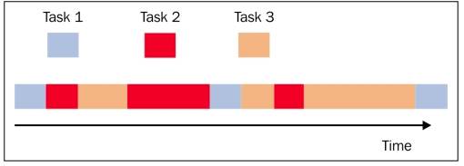
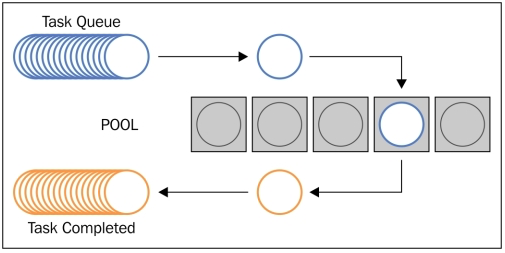

# Chapter 4. Asynchronous Programming

In this chapter, we will cover the following recipes:  

- How to use the concurrent.futures Python module
- Event loop management with Asyncio
- Handling coroutines with Asyncio
- Task manipulation with Asyncio
- Dealing with Asyncio and Futures

## Introduction

With the sequential and parallel execution model, there is a third model, called the asynchronous model, that is of fundamental importance to us along with the concept of event programming. The execution model of asynchronous activities can be implemented using a single stream of main control, both in uniprocessor systems and multiprocessor systems.  

In the asynchronous model of a concurrent execution, various tasks intersect with the timeline, and all of this happens under the action of a single flow of control (single-threaded). The execution of a task can be suspended and then resumed, but this alternates the time of other tasks. The following figure expresses this concept in a clear manner:  



As you can see, the tasks (each with a different color) are interleaved with one another, but they are in a single thread of control; this implies that when one task is in execution, the other tasks are not. A key difference between the multithreaded programming model and the single-threaded asynchronous concurrent model is that in the first case, the operating system decides on the timeline, whether to suspend the activity of a thread and start another, while in the second case, the programmer must assume that a thread may be suspended and replaced with another at any time.  

The programmer can program a task as a sequence of smaller steps that are executed intermittently; so if a task uses the output of another, the dependent task must be written to accept its input.  

## Using the concurrent.futures Python modules

With the release of Python 3.2, the concurrent.future module was introduced, which allows us to manage concurrent programming tasks, such as process and thread pooling, nondeterministic execution flows, and processes and thread synchronization.  

This package is built by the following classes:  

- concurrent.futures.Executor: This is an abstract class that provides methods to execute calls asynchronously.
- submit (function ,argument): This schedules the execution of a function (called callable) on the arguments.
- map (function,argument): This executes the function on arguments in an asynchronous mode.
- shutdown (Wait = True): This signals the executor to free any resource.
- concurrent.futures.Future: This encapsulates the asynchronous execution of a callable function. Future objects are instantiated by submitting tasks (functions with optional parameters) to executors.

Executors are abstractions that are accessed through their subclasses: thread or process ExecutorPools. In fact, instantiation of threads and process is a resource-demanding task, so it is better to pool these resources and use them as repeatable launchers or executors (hence, the executors concept) for parallel or concurrent tasks.  

### Dealing with the process and thread pool

A thread or process pool (also called pooling) indicates a software manager that is used to optimize and simplify the use of threads and/or processes within a program. Through the pooling, you can submit the task (or tasks) that are to be executed to the pooler. The pool is equipped with an internal queue of tasks that are pending and a number of threads or processes that execute them. A recurring concept in pooling is reuse: a thread (or process) is used several times for different tasks during its lifecycle. It decreases the overhead of creating and increasing the performance of the program that takes advantage of the pooling. Reuse is not a rule, but it is one of the main reasons that lead a programmer to use pooling in his/her application.  


Pooling management

### Getting ready

The current.Futures module provides two subclasses of the Executor class, respectively, which manipulates a pool of threads and a pool of processes asynchronously. The two subclasses are as follows:  

- concurrent.futures.ThreadPoolExecutor(max_workers)
- concurrent.futures.ProcessPoolExecutor(max_workers)


The max_workers parameter identifies the max number of workers that execute the call asynchronously.  

### How to do it…

The following example shows you the functionality of process and thread pooling. The task to be performed is that we have a list of numbers from one to 10, number_list. For each element of the list, a count is made up to 10,000,000 (just to waste time) and then the latter number is multiplied with the ith element of the list.  

By doing this, the following cases are evaluated:  

- Sequential execution
- A thread pool with 5 workers

Consider the following code:  

```python
#
# Concurrent.Futures Pooling - Chapter 4 Asynchronous Programming
#

import concurrent.futures
import time

number_list = [1,2,3,4,5,6,7,8,9,10]

def evaluate_item(x):
    #count...just to make an operation   
    result_item = count(x)
    #print the input item and the result
    print ("item " + str(x) + " result " + str(result_item))

def count(number) : 
    for i in range(0,10000000):
        i=i+1
    return i*number
 
if __name__ == "__main__":

##Sequential Execution
    start_time = time.clock()
    for item in number_list:
        evaluate_item(item)
    print ("Sequential execution in " + \
           str(time.clock() - start_time), "seconds")

    ##Thread pool Execution
    start_time_1 = time.clock()
    with concurrent.futures.ThreadPoolExecutor(max_workers=5)\
         as executor:
        for item in number_list:
            executor.submit(evaluate_item, item)
    print ("Thread pool execution in " + \
           str(time.clock() - start_time_1), "seconds")

    ##Process pool Execution
    start_time_2 = time.clock()
    with concurrent.futures.ProcessPoolExecutor(max_workers=5)\
         as executor:
        for item in number_list:
            executor.submit(evaluate_item, item)
    print ("Process pool execution in " + \
           str(time.clock() - start_time_2), "seconds")
```

After running the code, we have the following results with the execution time:  

```shell
C:\Python CookBook\Chapter 4- Asynchronous Programming\ >python Process_pool_with_concurrent_futures.py
item 1 result 10000000
item 2 result 20000000
item 3 result 30000000
item 4 result 40000000
item 5 result 50000000
item 6 result 60000000
item 7 result 70000000
item 8 result 80000000
item 9 result 90000000
item 10 result 100000000
Sequential execution in 17.241238674183425 seconds

item 4 result 40000000
item 2 result 20000000
item 1 result 10000000
item 5 result 50000000
item 3 result 30000000
item 7 result 70000000
item 6 result 60000000
item 8 result 80000000
item 10 result 100000000
item 9 result 90000000
Thread pool execution in 17.14648646290675 seconds

item 3 result 30000000
item 1 result 10000000
item 2 result 20000000
item 4 result 40000000
item 5 result 50000000
item 6 result 60000000
item 7 result 70000000
item 9 result 90000000
item 8 result 80000000
item 10 result 100000000
Process pool execution in 9.913172716938618 seconds
```

### How it works…

We build a list of numbers stored in number_list and for each element in the list, we operate the counting procedure until 100,000,000 iterations. Then, we multiply the resulting value for 100,000,000:  

```python
def evaluate_item(x):
    #count...just to make an operation   
    result_item = count(x)

def count(number) : 
    for i in range(0,10000000):
        i=i+1
    return i*number
```

In the main program, we execute the task that will be performed in a sequential mode:  

```python
if __name__ == "__main__":
   for item in number_list:
       evaluate_item(item)
```

Also, in a parallel mode, we will use the concurrent.futures module's pooling capability for a thread pool:  

```python
    with concurrent.futures.ThreadPoolExecutor(max_workers=5)\
         as executor:
        for item in number_list:
            executor.submit(evaluate_item, item)
```

The ThreadPoolExecutor executes the given task using one of its internally pooled threads. It manages five threads working on its pool. Each thread takes a job out from the pool and executes it. When the job is executed, it takes the next job to be processed from the thread pool.  

When all the jobs are processed, the execution time is printed:  

```python
print ("Thread pool execution in " + \
           str(time.clock() - start_time_1), "seconds")
```

For the process pooling implemented by the ProcessPoolExecutor class, we have:  

```python
    with concurrent.futures.ProcessPoolExecutor(max_workers=5)\
         as executor:
        for item in number_list:
            executor.submit(evaluate_item, item)
```

Like ThreadPoolExecutor, the ProcessPoolExecutor class is an executor subclass that uses a pool of processes to execute calls asynchronously. However, unlike ThreadPoolExecutor, the ProcessPoolExecutor uses the multiprocessing module, which allows us to outflank the global interpreter lock and obtain a shorter execution time.  

### There's more…

The pooling is used in almost all server applications, where there is a need to handle more simultaneous requests from any number of clients. Many other applications, however, require that each task should be performed instantly or you have more control over the thread that executes it. In this case, pooling is not the best choice.  
